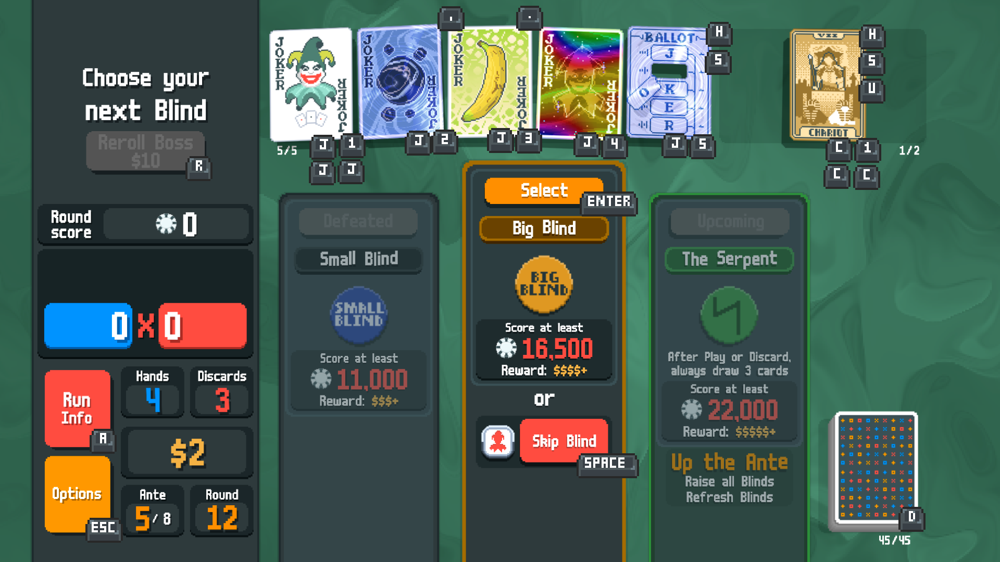
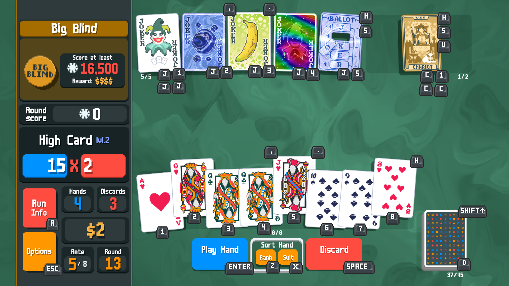
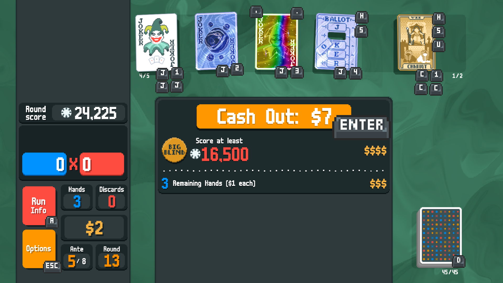
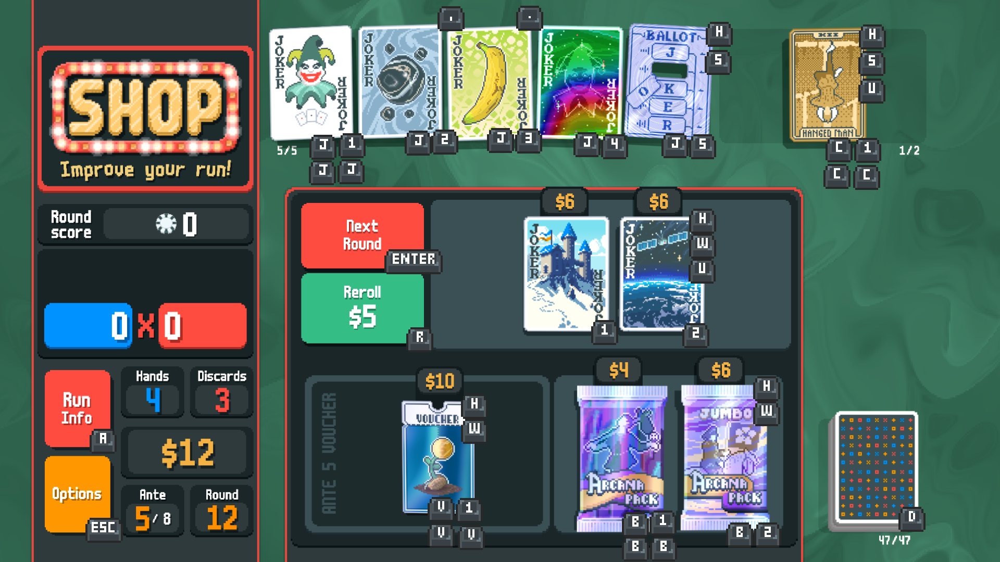
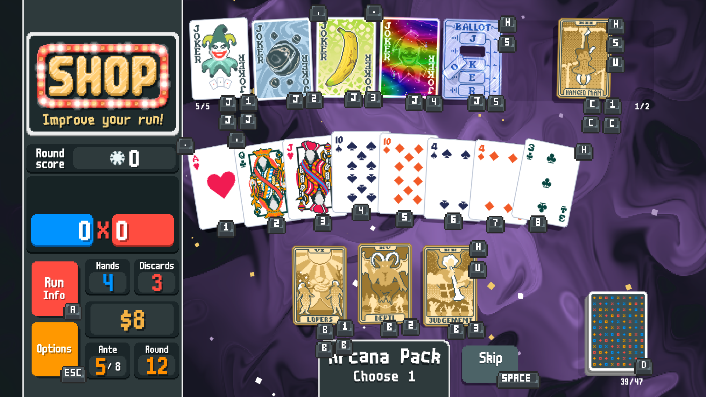

# [WIP] Keyboard Voucher - a [Balatro](https://store.steampowered.com/app/2379780/Balatro/) mod for shortcuts

Based on [Mi1ck](https://github.com/Mi1cK)'s [QOL mod](https://github.com/Mi1cK/Milcks-QOL)

## Key Bindings

As of now, keybindings can be modified only via editing the mod itself, rebinding in-game is planned in the future.

### Selecting cards

Use [1] - [0] to select cards 1 through 10. To go above 10, use the +10 modifier [=]. For the playing cards hitting an already selected card removes selection; other card types can be only selected one at a time.

### Selecting not-a-hand

In order to select Jokers, consumables (Specrtals / Tarots / Planets) and other slots, use modifiers that change your selection category:
- [ J ] to select Jokers
- [ C ] to select cards in a consumable area
- [ V ] to select Vouchers in the shop
- [ B ] to select Booster packs and their cards

For anything else (your playing hand and main shop slots) do not specify the category. As a shortcut, you can double the category key to select the first item in the category (for example, [ V ] + [ V ] to select the first Voucher)

### Card actions

Once you've selected the card, you might consider doing something with it. Right now the following actions are supported:
- [ W ] to buy the card from shop / redeem a Voucher / open a Booster pack
- [ S ] to sell the card in your possession
- [ U ] to use / buy and use consumable
- [ , ] / [ . ] to move your card left/right in the hand order
- [ H ] to display card information (usually available when you hover over it)

### Other actions

- [ Enter ] to play hand / exit shop / start a blind
- [ Space ] to discard hand / skip a blind / skip a Booster pack
- [ R ] to reroll the shop / the boss blind
- [ A ] to open the Run Info window
- [ D ] to open the Deck Info window
- Hold [ Left Shift ] to peek at your deck information
- [ Z ] / [ X ] to sort your hand by rank / suit

### Binding layouts

Note: keys displayed here are for demonstration purposes and are not the part of the in-game UI.

## Installation

Tested and written for [Steamodded v0.9.5](https://github.com/Steamopollys/Steamodded/tree/0.9.5). Just drop the .lua file into your Mods folder.

## Known Issues

### Bugs

- Trying to spam cash out before "Cash out" button is shown may lead to: lower cash out, multiple cash out, crashes. Please wait until "Cash out" button is shown.
Will be updated as new issues open.

### Planned/Missing features

- Cannot open tag description when selecting blinds
- Menu navigation: selecting options, switching between tabs, etc.
- UI for rebinding shortcuts in-game
- In-game UI for displaying current selection (how though?)
- "Assist" mode to show available shortcuts on game objects

## Contributing

Pull requests are welcome.

## License

[MIT](https://choosealicense.com/licenses/mit/)

